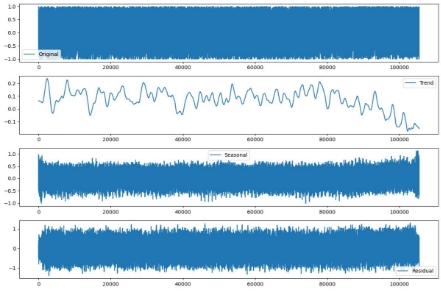
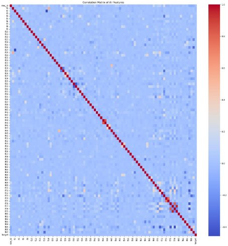
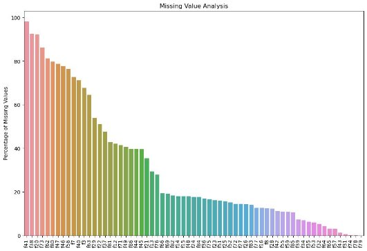
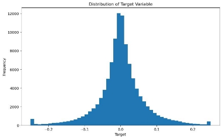
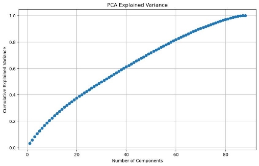
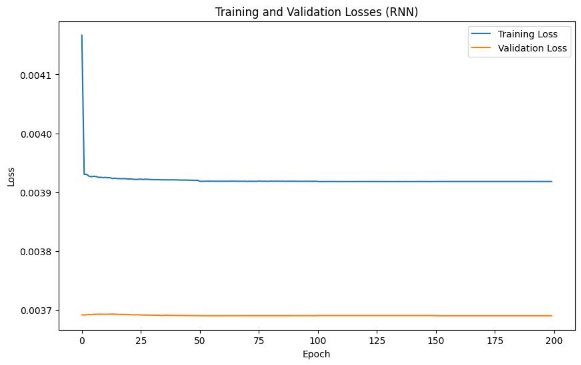

# Excess Stock Return Predictions

[Task and Dataset](https://www.kaggle.com/competitions/trexquant-2025-summer-intern-challenge-bits-pilani/data)\
I approached the task by dividing it into multiple subsections. I used python3 to complete this task along with several libraries like pandas, NumPy, scikit-learn etc. They are as follows: 

## ***Loading and Exploration of Data:*** 

We first attempt to get some initial insights into the dataset. the training data has 105,442 unique entries, each identified by a row\_id. The data has 87 features, and a target value is provided for each entry.  

Various statistics like mean, median, percentiles etc. are calculated for manual inspection and getting an idea about the data distribution – all the features consist of floating point values, lying in a range of ±4.  

We then move to our visualisation techniques like histograms to view the distribution of values of some features. This shows us that several features exhibit near normal distributions while several don’t. We also attempt to plot the values in order of row\_id i.e. against time. However, it is difficult to derive any insights from these plots. 

The temporal nature of our data means we must look for time series patterns in the features. First, we tried to decompose some selected features as a time series, considering seasonality, trends, and noise, using different values of the period. However, this fails and we are pushed to believe that the time series of the features are stationary. This is further confirmed by a statistical test - the Augmented Dickey-Fuller (ADF) test.  

The above image gives you a clear idea that there is no discernible trend or seasonality in this feature. 

Lastly, we make use of a heatmap to visualise correlation i.e. linear relationships between various variables. Other than 2 to 3 exceptions most features have weak linear relationships. 

## ***Handling missing values and outliers:*** 

To ensure that we have a clean and consistent dataset, we must fill in all the missing values and eliminate any outliers that may create bias in our predictions.  

We consider multiple methods to handle the missing values, such as using a constant value or measures like mean, mode, or median but these methods would result in the loss of information of how the data is distributed. k-Nearest Neighbours imputation will be challenging for data of such high dimensionality. As we saw earlier, the time series of features are stationary and hence it doesn’t make sense to decompose them. Rolling averages could be used, but several features have large gaps of data which would require larger window sizes while traversing, leading to the possibility of creation of bias.  

Ultimately, we decide to use the Last Observation Carried Forward (LOCF) method to handle the missing values. However, this was not sufficient for cases where the first few values of the features were empty, so we also used the Next Observation Carried Backward (NOCB) method after LOCF. Note that NOCB was used for a very small number of values in only a few features (less than 0.04%) and would not introduce any significant bias. Below is a graph of feature wise missing values. 

Outliers were plotted using box plots on a per-feature basis. The removal of outliers using standard methods like calculation of z-score and removal of entries outside the inter-quartile range were too harsh for this dataset and led to extreme data loss. At the same time, we could observe that the range of the data was quite restricted and within a reasonable range. So I didn’t remove any values. 

## ***Visualising the Target Variable:*** 

We first visualise the distribution of the target variable using a histogram given below.  

The target appears to have a near normal distribution. We also make several scatter plots of features vs target but this does not provide any meaningful insights due to the extremely large number of data points.  

Feature  vs  feature  scatter  plots  in  relation  to  the  target  are  also  drawn  to  get  a  better understanding of  their distribution against each other - we notice that most of the features seem to be strictly bounded with very few data points outside a certain range. 

Lastly, a correlation heat map is used to see the linear relationships between the target and other features – they are all weak/absent. 

## ***Dimensionality Reduction:*** 

The large number of dimensions of the dataset will impact both the efficiency and accuracy of our models so we attempt to reduce the dimensionality.  

We attempt to visualize our data in lower dimensions by applying PCA and reducing it to just 2 dimensions. We also plot a graph to observe the amount of captured variance based on the number of principal components being used. To preserve 95% of the variance, we need 77 components, which we then apply to both the test and train datasets. 

With the dimensionality reduction complete, our datasets are now ready for use in models. 

## ***Model Training and Testing:*** 

There are large variety of existing machine learning techniques for regression. We train and make predictions with several of them to see which would work best for us. The lack of knowledge as to what exactly our features actually represent and what their values mean implies that we cannot narrow down/ rule out any option so easily. K-fold cross validation while used while training for a robust model – care was taken to not introduce any look-ahead bias by ensuing the values do not get shuffled and their sequence is maintained.  

Our starting point is linear models like linear regression, lasso regression, ridge regression and Bayesian ridge regression. These models are good starting point for most regression problems, though they may face an issue due to the high dimensional and non-linear nature of the data.  

We then switched to decision tree based models like random forest, XGBoost and LightGBM. XGBoost and LightGBM are gradient boosting frameworks that uses a combination of simpler models like decision trees.  

ElasticNet – a hybrid of lasso and ridge regression was also used, along with support vector regression. Additionally, we experimented with ensemble techniques like voting and stacking regressors – these utilise multiple base models and combine them to outperform a given single model.  

A simple one layer neural network with rectified linear unit activation was also considered, along with a simple recurrent neural network – however, neither provided good results and largely failed to learn any features from the dataset - this may be due to insufficient amount of data  leading  to  overfitting  –  the  model  memorised  the  training  data  and  is  unfit  for generalisation. Below is a graph of the loss function which shows this. 

The metric we used for evaluation was Mean Squared Error (MSE). MSE is a widely used regression metric that penalizes larger errors more heavily, making it a suitable choice for this problem where we want to minimize the overall error in the predictions. 

After training and evaluating all the models, the final submission was made using the results from the Bayesian Ridge Regression model, as it provided the best performance among the models we tested. 
